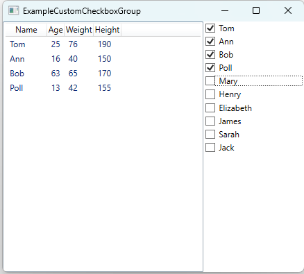

# CustomCheckboxGroup
## Simple example custom collection of checkbox for wpf mvvm application
This project features a class implemented as a UserControl in WPF, which encapsulates a group of checkboxes.
Key Benefits
- MVVM Pattern Support: The UserControl is designed to seamlessly integrate with the MVVM pattern. You can declare the UserControl in your WPF markup and bind data using standard bindings.
- No External Dependencies: The source code is free from dependencies on external libraries, utilizing only standard C# features. This ensures ease of use and integration into various projects.
- Template for Customization: This code serves as a template for creating your own CustomCheckboxGroup. You can study the existing implementation and modify it to suit your specific needs.
  
Implementation Details: The project utilizes the DependencyProperty class to manage property values and support data binding effectively.

##  The project contains two types of CheckboxGroup, each of which has an example.
ExampleCheckboxGroup  

ExampleCheckboxGroupTopLabel 

